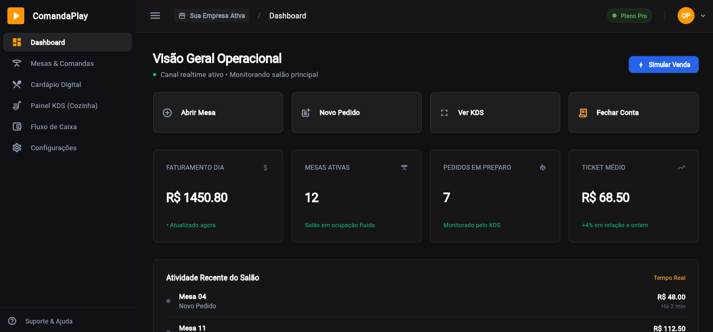
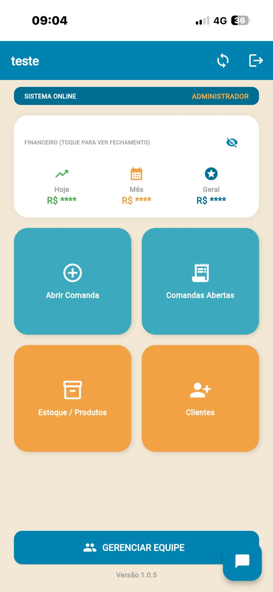

# Mailson Oliveira 👋

Flutter Developer focused on building real-world SaaS products using Flutter, Dart and Firebase.

## 🚀 Main Projects

### Restaurant SaaS Platform

Multi-tenant restaurant management platform featuring:

* Digital Menu
* QR Ordering
* Kitchen Display System (KDS)
* Financial Dashboard
* Employee Management
* Customer Loyalty Program

* 

### Comanda Play SaaS

Subscription-based restaurant management platform.

Features:

* Order Management
* Inventory Control
* Financial Dashboard
* Customer Loyalty
* Employee Management
* Email Reports

### Digital Voting System

Voting platform developed for a municipal event.

Features:

* CPF Validation
* Anti-Duplicate Voting
* Real-Time Ranking
* Administrative Dashboard

* 

## 🛠 Tech Stack

* Flutter
* Dart
* Firebase
* Firestore
* Git
* GitHub
* SaaS Architecture
* Multi-Tenant Architecture

## 📫 Contact
WhatsApp: 67 9 8133-4950

LinkedIn:
www.linkedin.com/in/mailsondevflutter
